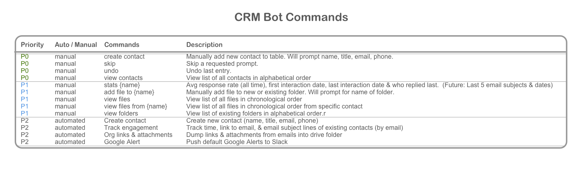
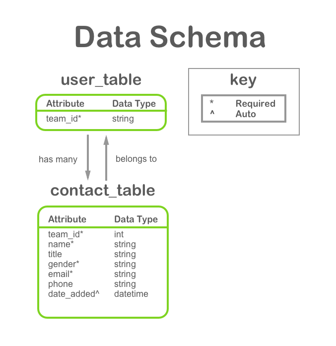
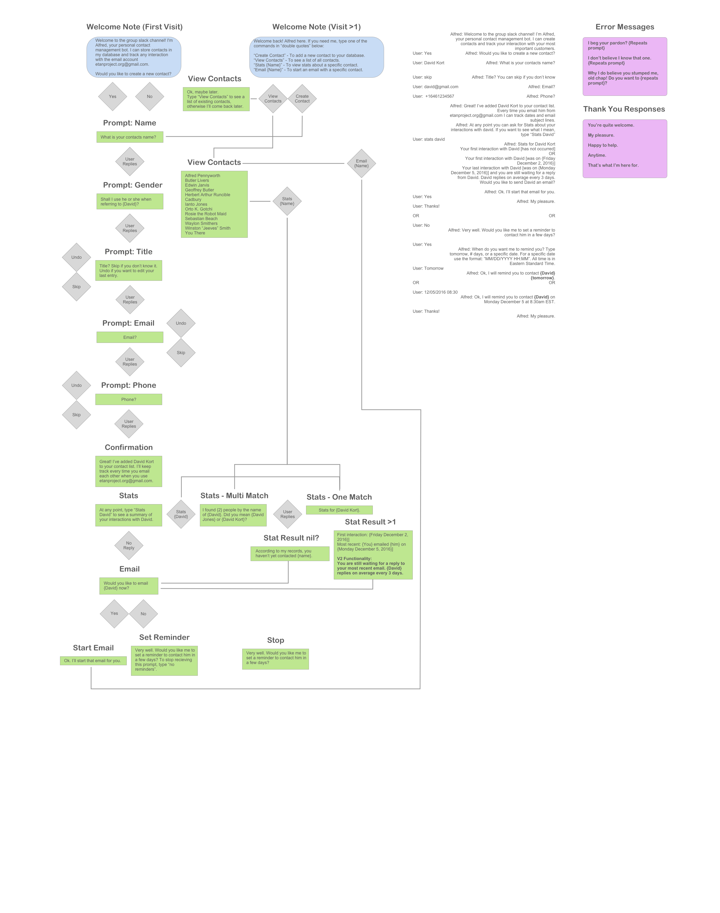
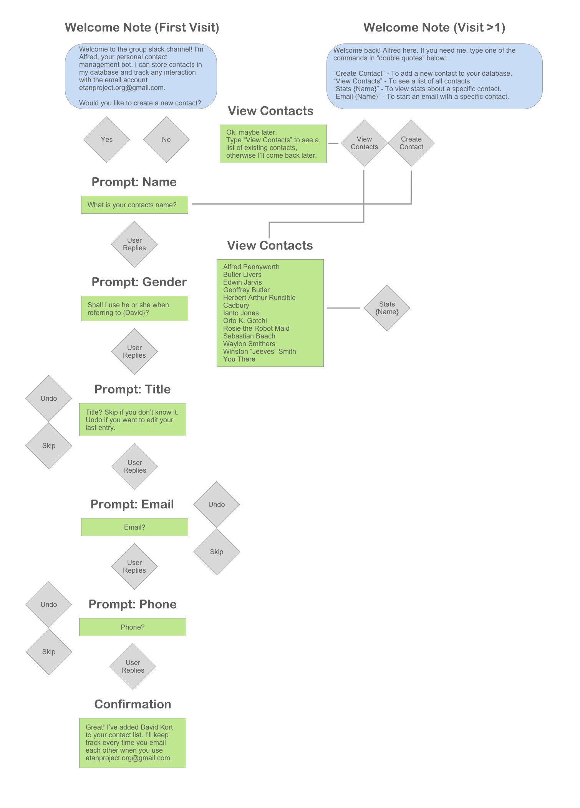

# CRM Bot Guide

Alfred knows you're very busy and in high demand, which is why he's offered to keep track of your contacts. He's still new, but eventually he'll be able to automatically store new contacts and start writing an email for you!

Sadly, however, at the moment he's only able to take down your contact's name, profession, email, and phone number. 

**Alfred Pennyworth**

[Image Source](http://vignette2.wikia.nocookie.net/batman/images/2/24/Alfred_Pennyworth.png)

**Alfred Pennyworth's Training Schedule**

#Alfred's Email Training Guides 
###aka Slack <> Gmail API Tutorials
Training Alfred will take some time. Here is some of the content we'll be covering with him. Do have patience, soon he will be in tip top shape and up to speed.
LINKS COMING SOON

#Alfred's Commands
How to talk so Alfred will listen, and listen so Alfred will talk:

###aka v1.0 Data Schema

#CRM Bot Workflows

 

